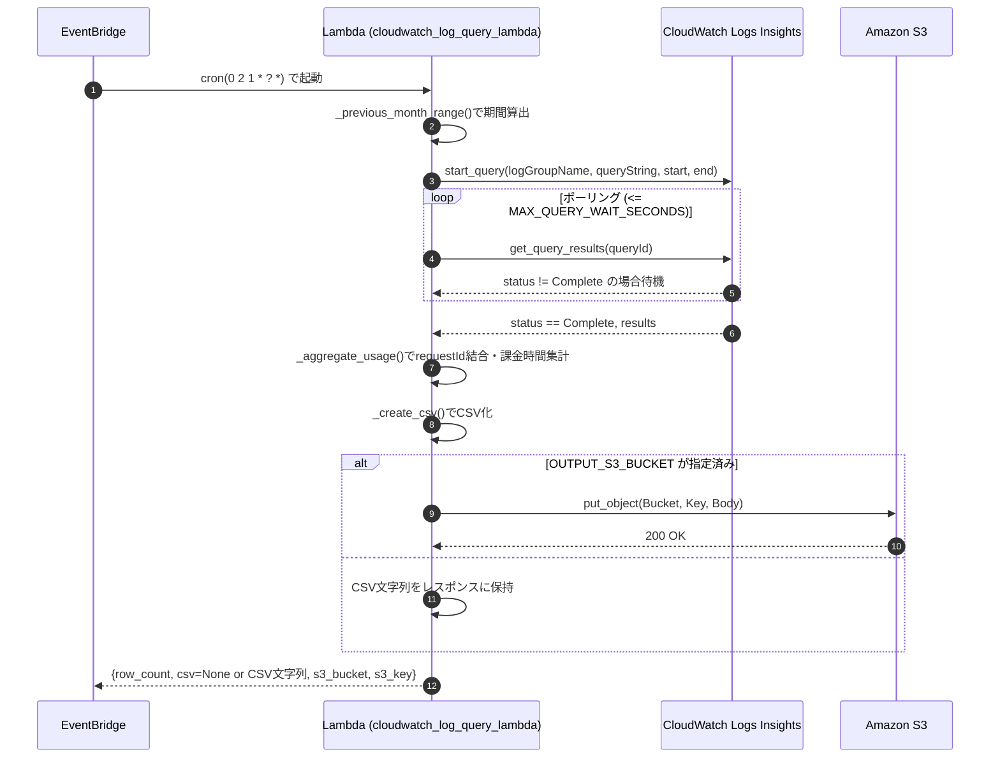
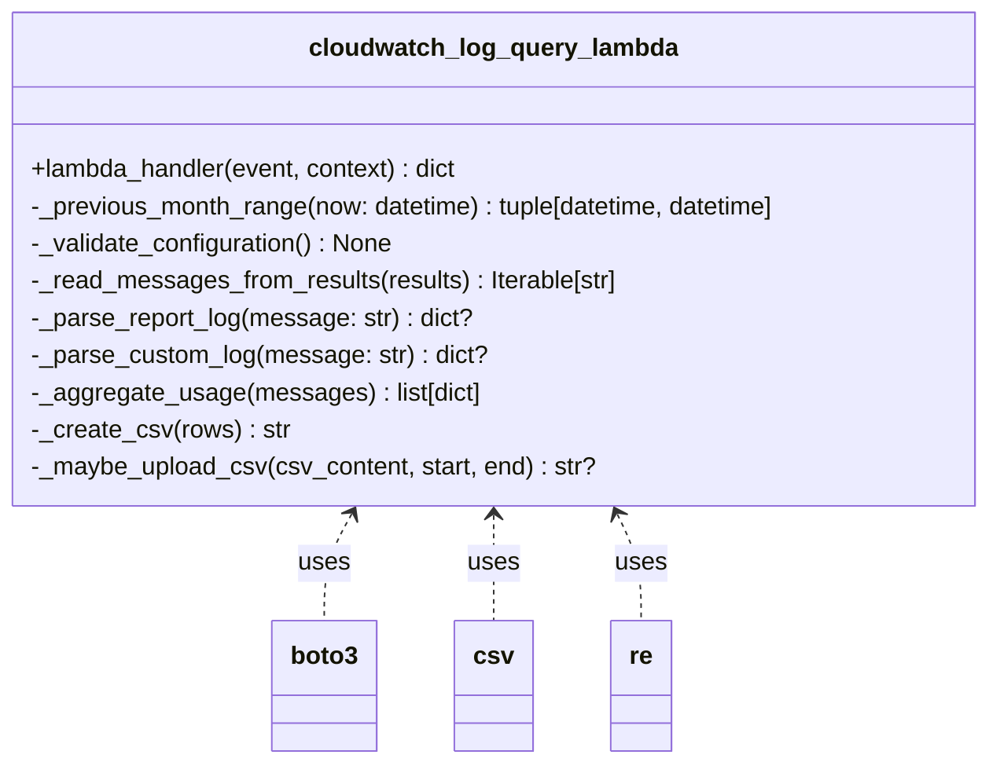

## 概要

- 本LambdaはEventBridgeにより毎月1日02:00(UTC)に起動し、先月1日00:00(UTC)から実行時刻までのCloudWatch Logs Insightsクエリを実行し、Lambda標準ログ(Report)とカスタムログをrequest IDで突き合わせ、クライアントIDとLambda実行メモリ容量ごとの課金時間合計をCSVにまとめる。
- CSVは環境変数設定に応じてS3へ保存し、保存先が未指定の場合はレスポンスにインラインで返す。

## トリガーとスケジュール

- EventBridgeルール: `cron(0 2 1 * ? *)` (UTC基準)
- Lambdaランタイム: Python 3.x
- IAM権限:
  - `logs:StartQuery`, `logs:GetQueryResults` (対象ロググループに対して)
  - `s3:PutObject` (CSVを保存する場合)

## 環境変数

| 変数名 | 必須 | デフォルト | 説明 |
| --- | --- | --- | --- |
| `LOG_GROUP_NAME` | ✓ | なし | クエリ対象のCloudWatch Logsグループ名 |
| `LOG_QUERY_STRING` | | REPORTログとrequestId/Client ID検出用のフィルタ | Logs Insightsクエリ (カスタムログ形式に合わせて調整) |
| `QUERY_POLL_INTERVAL_SECONDS` | | `2.0` | クエリ結果ポーリング間隔(秒) |
| `MAX_QUERY_WAIT_SECONDS` | | `60` | クエリ結果待機の最大秒数 |
| `OUTPUT_S3_BUCKET` | | なし | CSVの出力先S3バケット。空欄の場合はレスポンスへ埋め込む |
| `OUTPUT_S3_PREFIX` | | なし | S3オブジェクトキーのプレフィックス (例: `reports/cloudwatch`) |
| `CSV_INCLUDE_HEADERS` | | `true` | CSVにヘッダー行を含めるか |

## 処理フロー詳細

1. **設定検証**: `LOG_GROUP_NAME`と`LOG_QUERY_STRING`の存在チェック。
2. **期間算出**: 現在時刻(UTC)基準で先月1日00:00から実行時刻までの期間を取得。
3. **Logs Insights開始**: 上記期間、指定ロググループとクエリで`start_query`を呼び出し、`queryId`を取得。
4. **ポーリング**: 最大`MAX_QUERY_WAIT_SECONDS`まで`get_query_results`でクエリ状態を監視。`Complete`で次へ進み、それ以外の終了ステータス(Timeout, Failed, Cancelled)は例外。
5. **ログ解析**:
   - `REPORT`ログを正規表現で解析し、`requestId`, `billed_duration_ms`, `memory_size_mb`を抽出。
   - カスタムログから`requestId`とクライアント識別子を抽出。複数のキー名(`clientId`, `client-id`, `userId`など)に対応する正規表現。
   - requestIdをキーに突き合わせ、(クライアントID, メモリ容量)をキーとした課金時間(ミリ秒)合計を算出。
6. **CSV生成**: `client_identifier,memory_mb,billed_duration_ms`の3列で出力。キーは昇順ソート。
7. **出力**:
   - `OUTPUT_S3_BUCKET`が設定されている場合は`put_object`でアップロード。キーは`<prefix>/<YYYYMM>/usage_<YYYYMM>_<timestamp>.csv`。
   - バケット未指定の場合はCSV文字列をレスポンスボディへ格納。
8. **レスポンス**: `row_count`, `csv`(オプション), `s3_bucket`, `s3_key`を返却。

## エラーハンドリング

- Logs Insightsクエリが完了前にタイムアウトした場合は`TimeoutError`で失敗。
- クエリが`Cancelled`/`Failed`/`Timeout`ステータスを返した場合は`RuntimeError`。
- 必須環境変数が設定されていない場合は起動時に`ValueError`。

## シーケンス図

## クラス図（モジュール構造）

## 検証

- 2025-11-11 時点でローカル実行により、`client_identifier`と`memory_mb`の複合キーで`billed_duration_ms`が集計されたCSVが出力されることを確認済み。
  - 実行コマンド:
    - `AWS_DEFAULT_REGION=us-east-1 python3 - <<'PY' ...`（`_aggregate_usage`および`_create_csv`に対するサンプルデータでの動作確認）
- 出力例:
  - `client_identifier,memory_mb,billed_duration_ms`
  - `client-A,128,100`
  - `client-B,256,350`

## 運用上の注意点

- カスタムログのフォーマットが変更された場合、`LOG_QUERY_STRING`と正規表現(`REQUEST_ID_PATTERN`, `CLIENT_ID_PATTERN`)の調整が必要。
- Logs Insightsクエリの上限(`limit 10000`)に注意。期間内ログが多い場合は日分割などの処理が別途必要になる可能性がある。
- LambdaタイムアウトはLogs Insightsクエリ時間より長めに設定すること（推奨3分以上）。

